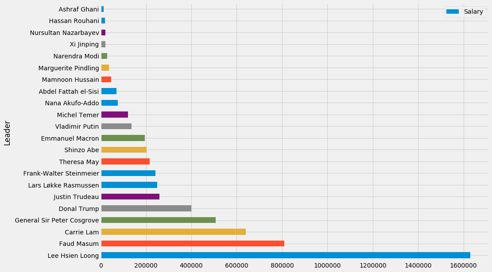
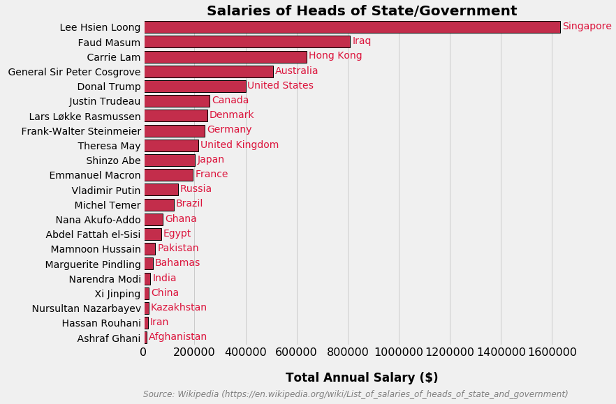

Creating a good plot is always tricky. You're constantly in a balancing act between having too much  information on the graph or having too little. At the end of the day, it's all about experimenting, trying to find that perfect graph looks good without withholding necessary information from the audience. In other words, the job of an analyst-designer is to create a graph that conveys all the information with the smallest number of elements. In the majority of cases, though, we can follow a few rules of thumb for creating effective plots:


> [Source](https://www.darkhorseanalytics.com/blog/data-looks-better-naked)

### Getting started

For my data, I use a small table from a [blog](https://thinkermag.tumblr.com) that lists the salaries of a few heads of state. I use the `requests` library to scrap the data from the webpage:

```python
import requests

# get the URL
r = requests.get('http://thinkermag.tumblr.com/post/177266283773/this-is-a-list-of-salaries-of-heads-of-state-and')

# extract content from page
c = r.content
c
```


    b'<!DOCTYPE html><script>var \__pbpa = true;</script><script>var translated_warning_string = \'Warning: Never enter your Tumblr password unless \\u201chttps://www.tumblr.com/login\\u201d\\x0ais the address in your web browser.\\x0a\\x0aYou should also see a green \\u201cTumblr, Inc.\\u201
    .
    .
    .
    </div>


Extract just the table that I need using HTML's `<li\>` tag:


```python
content = [i.getText() for i in main_content.findAll('li')]    
content
```


    ['Afghanistan, Ashraf Ghani, $13,400. Age: 69',
     'Australia, General Sir Peter Cosgrove, $507,340. Age: 71',
     'Bahamas, Marguerite Pindling, $37,000. Age: 86',
     'Brazil, Michel Temer, $120,000. Age: 77',
     'Canada, Justin Trudeau, $260,200. Age: 46',
     'China, Xi Jinping, $22,000. Age: 65',
     'Denmark, Lars Løkke Rasmussen, $249,774. Age: 54',
     'Egypt, Abdel Fattah el-Sisi, $70,400. Age: 63',
     'France, Emmanuel Macron, $194,300. Age: 40',
     'Germany, Frank-Walter Steinmeier, $240,933. Age: 62',
     'Ghana, Nana Akufo-Addo, $76,000. Age: 74',
     'Hong Kong, Carrie Lam, $639,650. Age: 61',
     'India, Narendra Modi, $28,000. Age: 67',
     'Iran, Hassan Rouhani, $18,947. Age: 69',
     'Iraq, Faud Masum, $809,673. Age: 80',
     'Japan, Shinzo Abe, $202,700. Age: 63',
     'Kazakhstan, Nursultan Nazarbayev, $20,400. Age: 78',
     'Pakistan, Mamnoon Hussain, $46,600. Age: 62',
     'Russia, Vladimir Putin, $136,000. Age: 65',
     'Singapore, Lee Hsien Loong, $1,631,000. Age: 66',
     'United Kingdom, Theresa May, $215,980. Age: 61',
     'United States, Donal Trump, $400,000. Age: 72']


### Data cleaning
The data is now in one long list where each element is a string and contains all the info for that head of state. To make it plottable, we need to split the strings into lists to be added to a dataframe later:


```python
countries = [i.split(',', 1)[0] for i in content]
countries
```


    ['Afghanistan',
     'Australia',
     'Bahamas',
     'Brazil',
     'Canada',
     'China',
     'Denmark',
     'Egypt',
     'France',
     'Germany',
     'Ghana',
     'Hong Kong',
     'India',
     'Iran',
     'Iraq',
     'Japan',
     'Kazakhstan',
     'Pakistan',
     'Russia',
     'Singapore',
     'United Kingdom',
     'United States']


```python
names = [i.split(',')[1] for i in content]
names
```


    [' Ashraf Ghani',
     ' General Sir Peter Cosgrove',
     ' Marguerite Pindling',
     ' Michel Temer',
     ' Justin Trudeau',
     ' Xi Jinping',
     ' Lars Løkke Rasmussen',
     ' Abdel Fattah el-Sisi',
     ' Emmanuel Macron',
     ' Frank-Walter Steinmeier',
     ' Nana Akufo-Addo',
     ' Carrie Lam',
     ' Narendra Modi',
     ' Hassan Rouhani',
     ' Faud Masum',
     ' Shinzo Abe',
     ' Nursultan Nazarbayev',
     ' Mamnoon Hussain',
     ' Vladimir Putin',
     ' Lee Hsien Loong',
     ' Theresa May',
     ' Donal Trump']


```python
age = [i.split(':')[-1].split('.')[0] for i in content]
age
```


    [' 69',
     ' 71',
     ' 86',
     ' 77',
     ' 46',
     ' 65',
     ' 54',
     ' 63',
     ' 40',
     ' 62',
     ' 74',
     ' 61',
     ' 67',
     ' 69',
     ' 80',
     ' 63',
     ' 78',
     ' 62',
     ' 65',
     ' 66',
     ' 61',
     ' 72']


```python
salaries = [i.split('$')[-1].split('.')[0] for i in content]
salaries

```


    ['13,400',
     '507,340',
     '37,000',
     '120,000',
     '260,200',
     '22,000',
     '249,774',
     '70,400',
     '194,300',
     '240,933',
     '76,000',
     '639,650',
     '28,000',
     '18,947',
     '809,673',
     '202,700',
     '20,400',
     '46,600',
     '136,000',
     '1,631,000',
     '215,980',
     '400,000']


Now with all our variables properly split up, we can create a dataframe to be used in plotting later on:


```python
import pandas as pd
df = pd.DataFrame({'Country': countries,
                  'Leader': names,
                  'Age': age,
                  'Salary': salaries})
df.head()
```


<div>
<style scoped>
    .dataframe tbody tr th:only-of-type {
        vertical-align: middle;
    }

    .dataframe tbody tr th {
        vertical-align: top;
    }

    .dataframe thead th {
        text-align: right;
    }
</style>
<table border="1" class="dataframe">
  <thead>
    <tr style="text-align: right;">
      <th></th>
      <th>Country</th>
      <th>Leader</th>
      <th>Age</th>
      <th>Salary</th>
    </tr>
  </thead>
  <tbody>
    <tr>
      <th>0</th>
      <td>Afghanistan</td>
      <td>Ashraf Ghani</td>
      <td>69</td>
      <td>13,400</td>
    </tr>
    <tr>
      <th>1</th>
      <td>Australia</td>
      <td>General Sir Peter Cosgrove</td>
      <td>71</td>
      <td>507,340</td>
    </tr>
    <tr>
      <th>2</th>
      <td>Bahamas</td>
      <td>Marguerite Pindling</td>
      <td>86</td>
      <td>37,000</td>
    </tr>
    <tr>
      <th>3</th>
      <td>Brazil</td>
      <td>Michel Temer</td>
      <td>77</td>
      <td>120,000</td>
    </tr>
    <tr>
      <th>4</th>
      <td>Canada</td>
      <td>Justin Trudeau</td>
      <td>46</td>
      <td>260,200</td>
    </tr>
  </tbody>
</table>
</div>


A quick check reveals that some of the datatypes of our dataframe columns are incorrect. This is a result of presence of punctuation and because we extracted them from strings.

```python
df.dtypes
```


    Country    object
    Leader     object
    Age        object
    Salary     object
    dtype: object


This is a quick fix.

```python
# convert dtypes of columns to correct type
df['Age'] = df['Age'].apply(pd.to_numeric)
df['Salary'] = df['Salary'].str.replace(',', '').apply(pd.to_numeric)
```


```python
df.head()
```


<div>
<style scoped>
    .dataframe tbody tr th:only-of-type {
        vertical-align: middle;
    }

    .dataframe tbody tr th {
        vertical-align: top;
    }

    .dataframe thead th {
        text-align: right;
    }
</style>
<table border="1" class="dataframe">
  <thead>
    <tr style="text-align: right;">
      <th></th>
      <th>Country</th>
      <th>Leader</th>
      <th>Age</th>
      <th>Salary</th>
    </tr>
  </thead>
  <tbody>
    <tr>
      <th>0</th>
      <td>Afghanistan</td>
      <td>Ashraf Ghani</td>
      <td>69</td>
      <td>13400</td>
    </tr>
    <tr>
      <th>1</th>
      <td>Australia</td>
      <td>General Sir Peter Cosgrove</td>
      <td>71</td>
      <td>507340</td>
    </tr>
    <tr>
      <th>2</th>
      <td>Bahamas</td>
      <td>Marguerite Pindling</td>
      <td>86</td>
      <td>37000</td>
    </tr>
    <tr>
      <th>3</th>
      <td>Brazil</td>
      <td>Michel Temer</td>
      <td>77</td>
      <td>120000</td>
    </tr>
    <tr>
      <th>4</th>
      <td>Canada</td>
      <td>Justin Trudeau</td>
      <td>46</td>
      <td>260200</td>
    </tr>
  </tbody>
</table>
</div>


```python
df.dtypes
```


    Country    object
    Leader     object
    Age         int64
    Salary      int64
    dtype: object


### The fun part: Plotting

Our dataframe is now ready to be visualized. A good first step to any kind of visualization is to generate a quick plot with all default parameters to see how to looks like and what changes need to be made. After that, it's just a matter of customizing the default plot until we've found one that we're satisfied with.

```python
import matplotlib as plt

# sort the dataframe based on Salary
df = df.sort_values('Salary', ascending=False).reset_index()

# create a quick plot
df.plot(kind='barh', x='Leader', y='Salary', figsize=(14,10))
```





Now that we know what are data looks like, we can go ahead with the customization. First, we can choose default style and font size. Matplot has [a bunch of styles](https://matplotlib.org/gallery/style_sheets/style_sheets_reference.html) that you can choose from. I chose `fivethirtyeight`.


```python
# pick style
plt.style.use('fivethirtyeight')
plt.rcParams['font.size'] = 14
```

Seaborn is built on top of Matplotlib. So, in *most* cases, their functions work in tandem. Below, I give a default plot size with Matplotlib and actually draw the graph with Seaborn.

```python
import seaborn as sns
import matplotlib.pyplot as plt

#create basic figure
fig, ax = plt.subplots(figsize=(10,8))
sns.barplot(x='Salary', y='Leader', data=df,
           color='crimson', edgecolor = 'k', linewidth=1, ax=ax)
```

I though it would be a better idea to put the names of the countries next to the edge of the bars. We can do this with a `for` loop on our dataframe that takes the names of the countries and puts them as `plt.text` elements on our plot.

```python
# annotate bars
for i, row in df.iterrows():
    plt.text(x=row['Salary']+8000, y=i+0.15, s=row['Country'], size=14, color='crimson')
```

And finally, give labels and caption (Rule of thumb: The fewer of these, the better. So I'm guilty of breaking this rule):

```python
# labels
plt.xticks(size=16)
plt.xlabel('Total Annual Salary ($)', fontweight='bold', labelpad=20)
plt.ylabel('')
plt.title('Salaries of Heads of State/Government', fontweight='bold')

# caption
txt = 'Source: Wikipedia (https://en.wikipedia.org/wiki/List_of_salaries_of_heads_of_state_and_government)'
plt.text(x=0, y=25, s=txt, size=12, fontstyle='italic', color='grey')
```





### Conclusion
Evidently, we can edit our graph even further. For example, we can get rid of the bottom label by adding "annual" to the title. The distance between the bars could be increased so that the plot doesn't look cluttered and the color of xy labels could be lightened to keep focus on the middle of the plot. In other words, this plot could be even more "naked".





* * *
##### SEE ALSO

* [Ten Simple Rules for Better Figures](https://journals.plos.org/ploscompbiol/article?id=10.1371/journal.pcbi.1003833), Nicolas P. Rougier, Michael Droettboom, and Philip E. Bourne. September 11, 2014.
* Although a useful method, web scraping should be [done with caution](https://www.storybench.org/to-scrape-or-not-to-scrape-the-technical-and-ethical-challenges-of-collecting-data-off-the-web/). Technical challenges aside, the web scraping process **must** always take ethical considerations into account.
