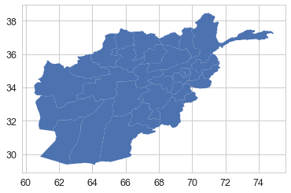
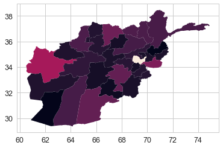
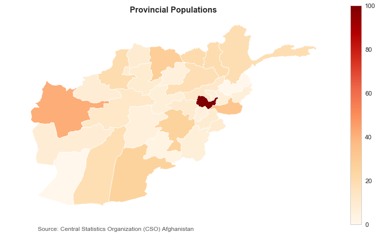
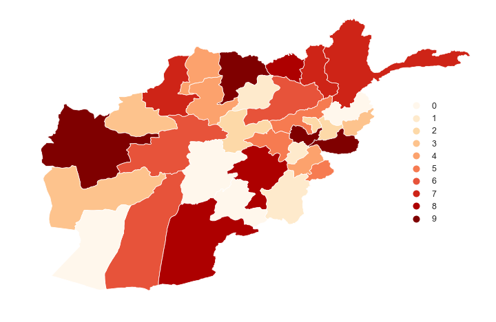
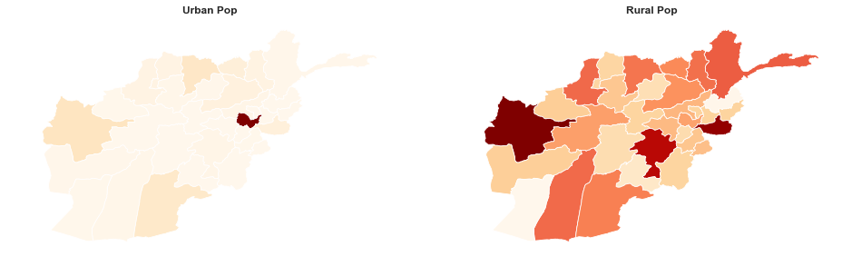

Those interested in a detailed study of Afghanistan's population movements, you can check this comprehensive [report](https://pubs.usgs.gov/sir/2013/5238/pdf/sir2013-5238.pdf) on using GIS-Based dasymetric mapping methods to visualize and see trends in Afghanistan's population. It can be found on the [USGIS website](https://pubs.er.usgs.gov/publication/sir20135238).


### Getting started

The first step of any good analysis: Load the libraries!


```python
import pandas as pd
import numpy as np
import matplotlib.pyplot as plt
import seaborn as sns
import plotly.plotly as py
import plotly.graph_objs as go
```

The dataset I used is sourced from Central Statistics Organization prepared by the Afghan government and is an estimated population count for 2015/2016.[^1]

Note the use of the `thousands` keyword argument. This tells the function that the dataset being imported has numbers with commas in the thousandths place and should be formatted as numbers. If this argument were not specified, the values would be read as strings (because of the commas).

```python
data = pd.read_csv('afg_pop.csv', thousands=',')
```

An alternative would have been to first import the dataset with all the columns as strings, and then use the `str` method to get rid of commas:

```python
data.iloc[:, 1:10].str.replace(',', '').astype('int64')
```


Lets take a closer look at our dataset:


```python
data.head(10)
```


<div>
<style scoped>
    .dataframe tbody tr th:only-of-type {
        vertical-align: middle;
    }

    .dataframe tbody tr th {
        vertical-align: top;
    }

    .dataframe thead th {
        text-align: right;
    }
</style>
<table border="1" class="dataframe">
  <thead>
    <tr style="text-align: right;">
      <th></th>
      <th>1</th>
      <th>CSO_PROV_NA_ENG</th>
      <th>TOTAL</th>
      <th>TOT_MALE</th>
      <th>TOT_FEMALE</th>
      <th>URB_TOTAL</th>
      <th>URB_MALE</th>
      <th>URB_FEMALE</th>
      <th>RUR_TOTAL</th>
      <th>RUR_MALE</th>
      <th>RUR_FEMALE</th>
      <th>Unnamed: 11</th>
      <th>Unnamed: 12</th>
    </tr>
  </thead>
  <tbody>
    <tr>
      <th>0</th>
      <td>2.0</td>
      <td>Kabul</td>
      <td>4372977.0</td>
      <td>2259199.0</td>
      <td>2113778.0</td>
      <td>3699866.0</td>
      <td>1915023.0</td>
      <td>1784843.0</td>
      <td>673111.0</td>
      <td>344176.0</td>
      <td>328935.0</td>
      <td>NaN</td>
      <td>NaN</td>
    </tr>
    <tr>
      <th>1</th>
      <td>3.0</td>
      <td>Kapisa</td>
      <td>441010.0</td>
      <td>222554.0</td>
      <td>218456.0</td>
      <td>1550.0</td>
      <td>904.0</td>
      <td>646.0</td>
      <td>439460.0</td>
      <td>221650.0</td>
      <td>217810.0</td>
      <td>NaN</td>
      <td>NaN</td>
    </tr>
    <tr>
      <th>2</th>
      <td>4.0</td>
      <td>Parwan</td>
      <td>664502.0</td>
      <td>336114.0</td>
      <td>328388.0</td>
      <td>59554.0</td>
      <td>30100.0</td>
      <td>29454.0</td>
      <td>604948.0</td>
      <td>306014.0</td>
      <td>298934.0</td>
      <td>NaN</td>
      <td>NaN</td>
    </tr>
    <tr>
      <th>3</th>
      <td>5.0</td>
      <td>Wardak</td>
      <td>596287.0</td>
      <td>304324.0</td>
      <td>291963.0</td>
      <td>3100.0</td>
      <td>1550.0</td>
      <td>1550.0</td>
      <td>593187.0</td>
      <td>302774.0</td>
      <td>290413.0</td>
      <td>NaN</td>
      <td>NaN</td>
    </tr>
    <tr>
      <th>4</th>
      <td>6.0</td>
      <td>Logar</td>
      <td>392045.0</td>
      <td>199447.0</td>
      <td>192598.0</td>
      <td>9947.0</td>
      <td>5038.0</td>
      <td>4909.0</td>
      <td>382098.0</td>
      <td>194409.0</td>
      <td>187689.0</td>
      <td>NaN</td>
      <td>NaN</td>
    </tr>
    <tr>
      <th>5</th>
      <td>7.0</td>
      <td>Nangarhar</td>
      <td>1517388.0</td>
      <td>776688.0</td>
      <td>740700.0</td>
      <td>230809.0</td>
      <td>118818.0</td>
      <td>111991.0</td>
      <td>1286579.0</td>
      <td>657870.0</td>
      <td>628709.0</td>
      <td>NaN</td>
      <td>NaN</td>
    </tr>
    <tr>
      <th>6</th>
      <td>8.0</td>
      <td>Laghman</td>
      <td>445588.0</td>
      <td>228323.0</td>
      <td>217265.0</td>
      <td>5168.0</td>
      <td>2713.0</td>
      <td>2455.0</td>
      <td>440420.0</td>
      <td>225610.0</td>
      <td>214810.0</td>
      <td>NaN</td>
      <td>NaN</td>
    </tr>
    <tr>
      <th>7</th>
      <td>9.0</td>
      <td>Panjsher</td>
      <td>153487.0</td>
      <td>78484.0</td>
      <td>75003.0</td>
      <td>NaN</td>
      <td>NaN</td>
      <td>NaN</td>
      <td>153487.0</td>
      <td>78484.0</td>
      <td>75003.0</td>
      <td>NaN</td>
      <td>NaN</td>
    </tr>
    <tr>
      <th>8</th>
      <td>10.0</td>
      <td>Baghlan</td>
      <td>910784.0</td>
      <td>466792.0</td>
      <td>443992.0</td>
      <td>184991.0</td>
      <td>94175.0</td>
      <td>90816.0</td>
      <td>725793.0</td>
      <td>372617.0</td>
      <td>353176.0</td>
      <td>NaN</td>
      <td>NaN</td>
    </tr>
    <tr>
      <th>9</th>
      <td>11.0</td>
      <td>Bamyan</td>
      <td>447218.0</td>
      <td>226669.0</td>
      <td>220549.0</td>
      <td>12918.0</td>
      <td>6459.0</td>
      <td>6459.0</td>
      <td>434300.0</td>
      <td>220210.0</td>
      <td>214090.0</td>
      <td>NaN</td>
      <td>NaN</td>
    </tr>
  </tbody>
</table>
</div>


The `pd.option_context` used below is a neat trick I learned from the good folks in the amazing Python community. What it's doing is simply *describing* the data and giving us some basic statistics about our data.

```python
# Use the pd.option_context function to display the numbers of each column properly.
with pd.option_context('float_format', '{:.0f}'.format):
  print(data.describe())
```

           1   TOTAL  TOT_MALE  TOT_FEMALE  URB_TOTAL  URB_MALE  URB_FEMALE  \
    count 33      34        34          34         31        31          31   
    mean  18  797099    407795      389304     216066    111270      104795   
    std   10  749568    386311      363287     663005    343078      319931   
    min    2  147967     75484       72483       1550       904         646   
    25%   10  436309    222686      213063      12596      6394        6201   
    50%   18  555782    284346      271436      37464     19248       18086   
    75%   26  975240    497269      477972     126342     64204       62138   
    max   34 4372977   2259199     2113778    3699866   1915023     1784843   

           RUR_TOTAL  RUR_MALE  RUR_FEMALE  Unnamed: 11  Unnamed: 12  
    count         34        34          34            0            0  
    mean      600098    306342      293756          nan          nan  
    std       297098    151274      145840          nan          nan  
    min       138366     70803       67563          nan          nan  
    25%       426229    218500      208660          nan          nan  
    50%       521484    266712      254772          nan          nan  
    75%       781866    399409      382458          nan          nan  
    max      1344541    680311      664230          nan          nan  


Always digging in a little deeper into our dataset to [know our data](https://towardsdatascience.com/know-your-data-part-1-c6bd56553ae8):

```python
# Print out column data types and null/non-null values
data.info()

# Number of rows and columns
print('\nRows, Columns: ', data.shape)
```

    <class 'pandas.core.frame.DataFrame'>
    RangeIndex: 38 entries, 0 to 37
    Data columns (total 13 columns):
    1                  33 non-null float64
    CSO_PROV_NA_ENG    34 non-null object
    TOTAL              34 non-null float64
    TOT_MALE           34 non-null float64
    TOT_FEMALE         34 non-null float64
    URB_TOTAL          31 non-null float64
    URB_MALE           31 non-null float64
    URB_FEMALE         31 non-null float64
    RUR_TOTAL          34 non-null float64
    RUR_MALE           34 non-null float64
    RUR_FEMALE         34 non-null float64
    Unnamed: 11        0 non-null float64
    Unnamed: 12        0 non-null float64
    dtypes: float64(12), object(1)
    memory usage: 3.9+ KB

    Rows, Columns:  (38, 13)


### Data cleaning

Alright, so now we have a good sense of what our data looks like, number of columns, and data types of each columns. As can be seen, the dataset imported contains some useless columns and an unnecessary index column. It also contains four rows at the end that are all 'nan' values. To remove the columns and 'nan' rows:


```python
data.drop(['Unnamed: 11', 'Unnamed: 12'], axis=1, inplace=True)
data.drop(['1'], axis=1, inplace=True)
data = data[data.TOTAL.notnull()]
```


```python
data.columns
```


    Index(['CSO_PROV_NA_ENG', 'TOTAL', 'TOT_MALE', 'TOT_FEMALE', 'URB_TOTAL',
           'URB_MALE', 'URB_FEMALE', 'RUR_TOTAL', 'RUR_MALE', 'RUR_FEMALE'],
          dtype='object')


The dataset columns are not very intuitive. So lets rename them with easily interpretable labels:


```python
data.columns = ['Province', 'Total', 'Male', 'Female',
                'Urban', 'Urban_Male', 'Urban_Female',
                'Rural', 'Rural_Male', 'Rural_Female']
```

There's a lot of good libraries out there for checking missing values and dealing with them. But with such a small and insignificant dataset, we're good with Python's built-in functions:


```python
missing = data.isnull().sum()
missing = missing[missing > 0]
print('Missing values:\n', missing)
```

    Missing values:
     Urban           3
    Urban_Male      3
    Urban_Female    3
    dtype: int64


### Mapping

For mapping, I'll use Geopandas library and ArcGIS Shapefile of Afghanistan's provincial boundaries.[^2] Map objects are essentially polygon objects and can be in multiple types of files, including JSON. You can play around creating your own polygon at [geojson.io](http://geojson.io/#map=2/20.0/0.0) and style them with Google's [Map Styling Wizard](https://mapstyle.withgoogle.com/).


```python
import geopandas as gpd
mapdf = gpd.read_file('AfgMaps/admin2_poly_32.shp')
mapdf.plot()
```





Map file well imported! The `mapdf` is  a GeoDataFrame which is a Pandas dataframe for polygon map objects with a column called `geometery` that contains the coordinates of the objects. We need to inspect the province names because, for later plotting, we'll be joining it with our original population dataframe.


```python
mapdf.head()
```


<div>
<style scoped>
    .dataframe tbody tr th:only-of-type {
        vertical-align: middle;
    }

    .dataframe tbody tr th {
        vertical-align: top;
    }

    .dataframe thead th {
        text-align: right;
    }
</style>
<table border="1" class="dataframe">
  <thead>
    <tr style="text-align: right;">
      <th></th>
      <th>AREA</th>
      <th>PERIMETER</th>
      <th>PRV32_ID</th>
      <th>PRV_NAME</th>
      <th>UN_ZONES</th>
      <th>geometry</th>
    </tr>
  </thead>
  <tbody>
    <tr>
      <th>0</th>
      <td>4.46398</td>
      <td>19.11597</td>
      <td>11</td>
      <td>BADAKHSHAN</td>
      <td>1</td>
      <td>POLYGON ((70.5068359375 38.123046875, 70.50678...</td>
    </tr>
    <tr>
      <th>1</th>
      <td>1.24419</td>
      <td>6.43316</td>
      <td>12</td>
      <td>TAKHAR</td>
      <td>1</td>
      <td>POLYGON ((69.33357238769531 37.1372184753418, ...</td>
    </tr>
    <tr>
      <th>2</th>
      <td>1.19200</td>
      <td>6.10249</td>
      <td>17</td>
      <td>JAWZJAN</td>
      <td>1</td>
      <td>POLYGON ((65.49161529541016 37.23888778686523,...</td>
    </tr>
    <tr>
      <th>3</th>
      <td>1.73879</td>
      <td>7.18234</td>
      <td>16</td>
      <td>BALKH</td>
      <td>1</td>
      <td>POLYGON ((66.48699951171875 37.33544921875, 66...</td>
    </tr>
    <tr>
      <th>4</th>
      <td>0.81247</td>
      <td>4.55180</td>
      <td>14</td>
      <td>KUNDUZ</td>
      <td>1</td>
      <td>POLYGON ((68.03881072998047 36.93278121948242,...</td>
    </tr>
  </tbody>
</table>
</div>


As we can see, the province names are all in uppercase while the those in our original dataframe have the `title` format with only the first letters in uppercase. Python, being case sensitive, will complain bitterly if we try to merge the dataframes. So lets change the province names to their proper `title` format:


```python
mapdf['PRV_NAME'] = mapdf.PRV_NAME.str.title()
mapdf.head()
```


<div>
<style scoped>
    .dataframe tbody tr th:only-of-type {
        vertical-align: middle;
    }

    .dataframe tbody tr th {
        vertical-align: top;
    }

    .dataframe thead th {
        text-align: right;
    }
</style>
<table border="1" class="dataframe">
  <thead>
    <tr style="text-align: right;">
      <th></th>
      <th>AREA</th>
      <th>PERIMETER</th>
      <th>PRV32_ID</th>
      <th>PRV_NAME</th>
      <th>UN_ZONES</th>
      <th>geometry</th>
    </tr>
  </thead>
  <tbody>
    <tr>
      <th>0</th>
      <td>4.46398</td>
      <td>19.11597</td>
      <td>11</td>
      <td>Badakhshan</td>
      <td>1</td>
      <td>POLYGON ((70.5068359375 38.123046875, 70.50678...</td>
    </tr>
    <tr>
      <th>1</th>
      <td>1.24419</td>
      <td>6.43316</td>
      <td>12</td>
      <td>Takhar</td>
      <td>1</td>
      <td>POLYGON ((69.33357238769531 37.1372184753418, ...</td>
    </tr>
    <tr>
      <th>2</th>
      <td>1.19200</td>
      <td>6.10249</td>
      <td>17</td>
      <td>Jawzjan</td>
      <td>1</td>
      <td>POLYGON ((65.49161529541016 37.23888778686523,...</td>
    </tr>
    <tr>
      <th>3</th>
      <td>1.73879</td>
      <td>7.18234</td>
      <td>16</td>
      <td>Balkh</td>
      <td>1</td>
      <td>POLYGON ((66.48699951171875 37.33544921875, 66...</td>
    </tr>
    <tr>
      <th>4</th>
      <td>0.81247</td>
      <td>4.55180</td>
      <td>14</td>
      <td>Kunduz</td>
      <td>1</td>
      <td>POLYGON ((68.03881072998047 36.93278121948242,...</td>
    </tr>
  </tbody>
</table>
</div>


Perfect! But we're not done yet. We need some further data cleaning of both our dataframes because:

1. Province names are originally not in English, so  spelling conventions differ for data gathered from different sources.
2. Two provinces, namely Panjsher and Daykundi, do not exist in the `mapdf` because these provinces are delineated after the map data was collected.

So lets fix them with the following lines of code:


```python
# Drop the two provinces that don't exist in map dataframe
data = data[(data.Province != 'Daykundi') & (data.Province != 'Panjsher')]

# Fill missing vals
data.fillna(0) ; data.head()
```


<div>
<style scoped>
    .dataframe tbody tr th:only-of-type {
        vertical-align: middle;
    }

    .dataframe tbody tr th {
        vertical-align: top;
    }

    .dataframe thead th {
        text-align: right;
    }
</style>
<table border="1" class="dataframe">
  <thead>
    <tr style="text-align: right;">
      <th></th>
      <th>Province</th>
      <th>Total</th>
      <th>Male</th>
      <th>Female</th>
      <th>Urban</th>
      <th>Urban_Male</th>
      <th>Urban_Female</th>
      <th>Rural</th>
      <th>Rural_Male</th>
      <th>Rural_Female</th>
    </tr>
  </thead>
  <tbody>
    <tr>
      <th>0</th>
      <td>Kabul</td>
      <td>4372977.0</td>
      <td>2259199.0</td>
      <td>2113778.0</td>
      <td>3699866.0</td>
      <td>1915023.0</td>
      <td>1784843.0</td>
      <td>673111.0</td>
      <td>344176.0</td>
      <td>328935.0</td>
    </tr>
    <tr>
      <th>1</th>
      <td>Kapisa</td>
      <td>441010.0</td>
      <td>222554.0</td>
      <td>218456.0</td>
      <td>1550.0</td>
      <td>904.0</td>
      <td>646.0</td>
      <td>439460.0</td>
      <td>221650.0</td>
      <td>217810.0</td>
    </tr>
    <tr>
      <th>2</th>
      <td>Parwan</td>
      <td>664502.0</td>
      <td>336114.0</td>
      <td>328388.0</td>
      <td>59554.0</td>
      <td>30100.0</td>
      <td>29454.0</td>
      <td>604948.0</td>
      <td>306014.0</td>
      <td>298934.0</td>
    </tr>
    <tr>
      <th>3</th>
      <td>Wardak</td>
      <td>596287.0</td>
      <td>304324.0</td>
      <td>291963.0</td>
      <td>3100.0</td>
      <td>1550.0</td>
      <td>1550.0</td>
      <td>593187.0</td>
      <td>302774.0</td>
      <td>290413.0</td>
    </tr>
    <tr>
      <th>4</th>
      <td>Logar</td>
      <td>392045.0</td>
      <td>199447.0</td>
      <td>192598.0</td>
      <td>9947.0</td>
      <td>5038.0</td>
      <td>4909.0</td>
      <td>382098.0</td>
      <td>194409.0</td>
      <td>187689.0</td>
    </tr>
  </tbody>
</table>
</div>


```python
#Rename the province names according to the spelling in the original dataset
replacements = {
        'PRV_NAME':{
                #old name : new name
                'Hilmand':'Helmand',
                'Hirat':'Herat',
                'Kunar': 'Kunarha',
                'Nuristan':'Nooristan',
                'Sari Pul':'Sar-e-pul',
                'Uruzgan':'Urozgan'}
        }
mapdf = mapdf.replace(replacements)

#Joining mapdf with population dataset with province name as index
choropleth_df = mapdf.set_index('PRV_NAME').join(data.set_index('Province'))
choropleth_df.head()
```
A choropleth is a thematic map in which areas are shaded or patterned in proportion to the measurement of the variable being displayed on the map. In our case, that is the total population of each province.


<div>
<style scoped>
    .dataframe tbody tr th:only-of-type {
        vertical-align: middle;
    }

    .dataframe tbody tr th {
        vertical-align: top;
    }

    .dataframe thead th {
        text-align: right;
    }
</style>
<table border="1" class="dataframe">
  <thead>
    <tr style="text-align: right;">
      <th></th>
      <th>AREA</th>
      <th>PERIMETER</th>
      <th>PRV32_ID</th>
      <th>UN_ZONES</th>
      <th>geometry</th>
      <th>Total</th>
      <th>Male</th>
      <th>Female</th>
      <th>Urban</th>
      <th>Urban_Male</th>
      <th>Urban_Female</th>
      <th>Rural</th>
      <th>Rural_Male</th>
      <th>Rural_Female</th>
    </tr>
    <tr>
      <th>PRV_NAME</th>
      <th></th>
      <th></th>
      <th></th>
      <th></th>
      <th></th>
      <th></th>
      <th></th>
      <th></th>
      <th></th>
      <th></th>
      <th></th>
      <th></th>
      <th></th>
      <th></th>
    </tr>
  </thead>
  <tbody>
    <tr>
      <th>Badakhshan</th>
      <td>4.46398</td>
      <td>19.11597</td>
      <td>11</td>
      <td>1</td>
      <td>POLYGON ((70.5068359375 38.123046875, 70.50678...</td>
      <td>950953.0</td>
      <td>484509.0</td>
      <td>466444.0</td>
      <td>37592.0</td>
      <td>19248.0</td>
      <td>18344.0</td>
      <td>913361.0</td>
      <td>465261.0</td>
      <td>448100.0</td>
    </tr>
    <tr>
      <th>Takhar</th>
      <td>1.24419</td>
      <td>6.43316</td>
      <td>12</td>
      <td>1</td>
      <td>POLYGON ((69.33357238769531 37.1372184753418, ...</td>
      <td>983336.0</td>
      <td>501522.0</td>
      <td>481814.0</td>
      <td>130217.0</td>
      <td>66142.0</td>
      <td>64075.0</td>
      <td>853119.0</td>
      <td>435380.0</td>
      <td>417739.0</td>
    </tr>
    <tr>
      <th>Jawzjan</th>
      <td>1.19200</td>
      <td>6.10249</td>
      <td>17</td>
      <td>1</td>
      <td>POLYGON ((65.49161529541016 37.23888778686523,...</td>
      <td>540255.0</td>
      <td>274937.0</td>
      <td>265318.0</td>
      <td>116395.0</td>
      <td>59167.0</td>
      <td>57228.0</td>
      <td>423860.0</td>
      <td>215770.0</td>
      <td>208090.0</td>
    </tr>
    <tr>
      <th>Balkh</th>
      <td>1.73879</td>
      <td>7.18234</td>
      <td>16</td>
      <td>1</td>
      <td>POLYGON ((66.48699951171875 37.33544921875, 66...</td>
      <td>1325659.0</td>
      <td>678118.0</td>
      <td>647541.0</td>
      <td>490781.0</td>
      <td>251979.0</td>
      <td>238802.0</td>
      <td>834878.0</td>
      <td>426139.0</td>
      <td>408739.0</td>
    </tr>
    <tr>
      <th>Kunduz</th>
      <td>0.81247</td>
      <td>4.55180</td>
      <td>14</td>
      <td>1</td>
      <td>POLYGON ((68.03881072998047 36.93278121948242,...</td>
      <td>1010037.0</td>
      <td>514068.0</td>
      <td>495969.0</td>
      <td>257242.0</td>
      <td>132210.0</td>
      <td>125032.0</td>
      <td>752795.0</td>
      <td>381858.0</td>
      <td>370937.0</td>
    </tr>
  </tbody>
</table>
</div>


"Incremental programming/analysis" is always a good idea. So lets first just plot our map to see if everything works fine.


```python
choropleth_df.plot(column='Total')
```





Perfect! Let's customize our choropleth to make it pretty :D


```python
fig, ax = plt.subplots(figsize=(14,8))
choropleth_df.plot(column='Total', ax=ax, cmap='OrRd', linewidth=0.8, edgecolor='white')

ax.set_title('Provincial Populations', fontsize=16, fontweight='bold')
ax.annotate('Source: Central Statistics Organization (CSO) Afghanistan',
           xy=(0.1, 0.08), xycoords='figure fraction', horizontalalignment='left',
           verticalalignment='top', fontsize=12, color='#555555')

ax.axis('off')
sm = plt.cm.ScalarMappable(cmap='OrRd', norm=plt.Normalize(vmin=0, vmax=100))
sm._A = []
cbar = fig.colorbar(sm)
```





As we can see, most of the urban population is concentrated in Kabul province which houses the capital city, Kabul. The above graph shows the population in the given range of 1-100. Although, we can change the "scheme" of the map to `equal_interval` and `quantiles`, I think a better representation would be to bin the population in deciles. This is what I do with the following lines of code using the [Pysal](https://pysal.readthedocs.io/en/latest/) library:


```python
import pysal as ps # import Pysal
q10 = ps.Quantiles(choropleth_df.Total, k=10) # create the bins
q10.bins # get the bins
```


    array([ 386929. ,  435995.6,  448248.2,  520545. ,  567079.5,  679978.4,
            943080.4, 1007659. , 1315976.2, 4372977. ])


```python
q10.yb # get y values of the bins
```


    array([7, 7, 4, 9, 8, 7, 1, 6, 4, 0, 3, 5, 9, 3, 2, 6, 2, 2, 9, 5, 9, 0,
           1, 4, 8, 5, 3, 1, 6, 0, 8, 0])


```python
fig, ax = plt.subplots(figsize=(14,8))
# Use the assign method plot the bins on the choropleth
choropleth_df.assign(cl=q10.yb).plot(column='cl', ax=ax, cmap='OrRd',
                                    linewidth=0.8, edgecolor='white',
                                    categorical=True, k=10,
                                   legend=True)
ax.set_axis_off()

#Change the location of the legend
leg = ax.get_legend()
leg.set_bbox_to_anchor((0., 0., 0.9, 0.7))
```





Visualizing urban and rural population counts across all provinces:


```python
choropleth_df['Urban'] = choropleth_df['Urban'].fillna(0) #fill the missing Urban values with zeros

fig, axes = plt.subplots(ncols=2, figsize=(16,8)) #create two plots

choropleth_df.plot(column='Urban', ax=axes[0], cmap='OrRd', linewidth=0.8, edgecolor='white')
choropleth_df.plot(column='Rural', ax=axes[1], cmap='OrRd', linewidth=0.8, edgecolor='white')


axes[0].set_title('Urban Pop', fontsize=12, fontweight='bold')
axes[1].set_title('Rural Pop', fontsize=12, fontweight='bold')

axes[0].axis('off') ; axes[1].axis('off')
```


    (59.785404586792, 75.6135898590088, 28.90508289337158, 38.94784908294677)





### Conclusion

That's it! And I've barely scratched the surface of using Python for geospatial analysis. In my experience, most good analysis in Python comes from a good knowledge of libraries already out there. This is specially true for geospatial analysis, and a good staring point would be [this](https://medium.com/@chrieke/essential-geospatial-python-libraries-5d82fcc38731) brief article on Medium.





* * *
##### FOOTNOTES


[^1]: [Source](https://data.humdata.org/dataset/estimated-population-of-afghanistan-2015-2016) of the population dataset.  
[^2]: Special thanks to Benjamin Cooley and his [awesome tutorial](https://towardsdatascience.com/lets-make-a-map-using-geopandas-pandas-and-matplotlib-to-make-a-chloropleth-map-dddc31c1983d) on creating maps with GeoPandas in Python.
